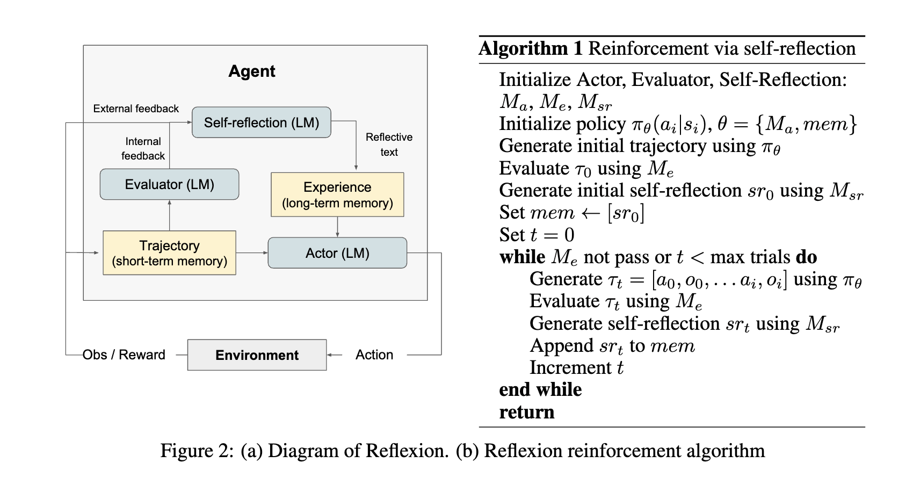

# ReflexionAgent

A Python implementation of the Reflexion framework for language agents with verbal reinforcement learning.



## Overview

ReflexionAgent is based on the paper ["Reflexion: Language Agents with Verbal Reinforcement Learning"](https://arxiv.org/abs/2303.11366) by Noah Shinn et al. (NeurIPS 2023). This implementation provides a powerful agent that can learn from its mistakes through verbal self-reflection, improving its performance over multiple trials without requiring model fine-tuning.

## What is Reflexion?

Reflexion is a novel framework that reinforces language agents through linguistic feedback rather than traditional reinforcement learning methods. Instead of updating model weights, Reflexion uses verbal feedback in the form of textual reflections that are added as additional context for future trials.

The key components of the Reflexion framework include:

1. **Actor**: Generates text and actions based on state observations
2. **Evaluator**: Scores outputs produced by the Actor
3. **Self-Reflection**: Generates verbal reinforcement cues to help the Actor improve

This approach allows language models to learn from trial and error more efficiently than traditional reinforcement learning methods, which typically require extensive training samples and expensive model fine-tuning.

## Features

- **Multiple Trials**: Automatically attempts a task multiple times, learning from previous failures
- **Verbal Reflection**: Generates detailed reflections on failures to guide future attempts
- **Success Criteria**: Supports user-defined success criteria to evaluate responses
- **Error Categorization**: Automatically categorizes errors to provide more specific feedback
- **Performance Tracking**: Tracks metrics across trials to measure improvement
- **Tool Integration**: Works with various tools to extend the agent's capabilities

## When to Use ReflexionAgent

ReflexionAgent is particularly useful when:

1. An agent needs to learn from trial and error
2. Traditional reinforcement learning methods are impractical
3. Nuanced feedback is required
4. Interpretability and explicit memory are important

The agent has shown effectiveness in tasks such as:
- Sequential decision-making
- Complex reasoning
- Programming and code generation

## Installation

```bash
# Clone the repository
git clone https://github.com/kargarisaac/reflexion.git
cd reflexion

# Install using Poetry
poetry install

# Activate the virtual environment
poetry shell
```

## API Keys

This project uses the Gemini API. The API key is stored in the `.env` file at the root of the project. You can find the existing API key there or replace it with your own.

## Usage

Here's a basic example of how to use the ReflexionAgent:

```python
from smolagents import ReflexionAgent, LiteLLMModel, DuckDuckGoSearchTool

# Initialize the model
model = LiteLLMModel(
    model_id="gemini/gemini-2.0-flash",
    api_key="your-api-key",  # Or load from .env file
    temperature=0.7,
    max_tokens=1000,
)

# Create tools
search_tool = DuckDuckGoSearchTool()

# Define success criteria
success_criteria = """
1. The answer must begin with a brief introduction.
2. The answer must include at least 3 specific strategies.
3. Each strategy should be explained in 2-3 sentences.
4. The answer must cite at least 2 specific sources.
5. The answer should be well-structured with clear sections.
"""

# Create the agent
agent = ReflexionAgent(
    tools=[search_tool],
    model=model,
    max_trials=3,           # Allow up to 3 attempts
    max_reflections=2,      # Keep the 2 most recent reflections
    max_steps=4,            # Maximum steps per trial
    verbosity_level=4,      # Detailed logging
    track_metrics=True,     # Track performance metrics
    success_criteria=success_criteria,
)

# Run the agent
result = agent.run("How should we handle the climate crisis?")

# Access the result
print(result["output"])     # The final answer
print(result["trials"])     # Number of trials taken
print(result["reflections"]) # List of reflections generated
```

## Advanced Example

The repository includes an example script (`example.py`) that demonstrates how to use the ReflexionAgent with success criteria and optional forced reflection:

```python
python example.py
```

You can also run with additional options:

```python
# Force a reflection by failing the first attempt
python example.py --force-reflection

# Use very strict success criteria
python example.py --very-strict
```

## API Reference

### ReflexionAgent

```python
ReflexionAgent(
    tools: List[Tool],
    model: Callable,
    max_trials: int = 5,
    max_reflections: int = 3,
    reflection_prompt_template: Optional[str] = None,
    success_criteria: Optional[str] = None,
    track_metrics: bool = True,
    **kwargs
)
```

#### Parameters

- **tools**: List of tools that the agent can use
- **model**: Model that will generate the agent's actions
- **max_trials**: Maximum number of trials to attempt for a task
- **max_reflections**: Maximum number of reflections to store in memory
- **reflection_prompt_template**: Template for generating error reflections
- **success_criteria**: User-defined success criteria for the output
- **track_metrics**: Whether to track performance metrics across trials
- **kwargs**: Additional arguments to pass to the parent CodeAgent

#### Methods

- **run(task, stream=False, reset=True, images=None, additional_args=None)**: Run the agent with the Reflexion framework
- **initialize_system_prompt()**: Initialize the system prompt, including reflections from previous trials

## How It Works

1. The agent attempts to solve a task
2. If it fails (due to an error or not meeting success criteria):
   - It generates a reflection on what went wrong
   - It stores this reflection in memory
   - It updates its system prompt to include the reflection
   - It tries again with the benefit of this reflection
3. This process continues until success or the maximum number of trials is reached
4. If successful after previous failures, it can generate a success reflection

## Limitations

- Relies on the agent's ability to accurately evaluate its performance
- Has constraints on long-term memory capacity
- May face limitations in certain code generation scenarios
